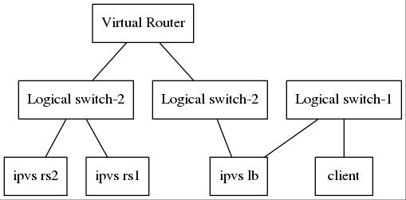

******************
ipvs nat mode test
******************

Per `VS-NAT figure <http://www.linuxvirtualserver.org/VS-NAT.html>`_, it
seems not so necessary to ensure lb and rs kept in the same L2/L3 segment.
Different than TUN and DR figures, rs send replys back to lb, and lb will
rewrite packets and response to client. So lb looks like a gateway for rs
behind it, it's the only entrance for request and response to go through.

But I'm not sure whether it's necessary to make things complex.

Topology
========

I build my environment in the following topology on OpenStack cloud platform.

CIDR & IPs
----------

switches:
  - switch-1: 192.168.1.0/24
  - switch-2: 22.22.22.0/24
  - switch-3: 33.33.33.0/24

hosts:
  - client IP: 192.168.1.74
  - ipvs lb IP: 192.168.1.85, 22.22.22.4
  - ipvs rs-1 IP: 33.33.33.5
  - ipvs rs-2 IP: 33.33.33.6

"Workaround"
============

Neutron native virtual L3 routing may not work well, you may need do some
workarounds to make:

  - lb can access rs
  - rs can access client

lb
-------

add route:
  - 33.33.33.0/24 via 22.22.22.1

sysctl:
  - enable forwarding
  - enable proxy_arp
  - disable rp_filter

router
------

add route:
  - 192.168.1.0/24 via 22.22.22.4

sysctl:
  - enable forwarding
  - enable proxy_arp
  - disable rp_filter

rs
--

add route:
  - 22.22.22.0/24 via 33.33.33.1
  - 192.168.1.0/24 via 33.33.33.1
