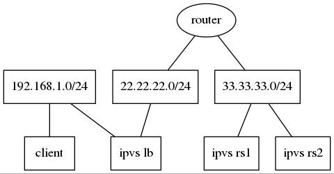

******************
ipvs tun mode test
******************

In `VS-IPTunneling <http://www.linuxvirtualserver.org/VS-IPTunneling.html>`_,
client requests can be forwarded from lb to rs via ip tunnel, but for
response, it doesn't tell whether they can be send back to lb via ip tunnel.
And that's what I'm going to do here.

Topology
========

I build my environment in the following topology on OpenStack cloud platform.

CIDR & IPs
----------

switches:
  - switch-1: 192.168.1.0/24
  - switch-2: 22.22.22.0/24
  - switch-3: 33.33.33.0/24

hosts:
  - client IP: 192.168.1.74
  - ipvs lb IP: 192.168.1.85, 22.22.22.4
  - ipvs rs-1 IP: 33.33.33.5
  - ipvs rs-2 IP: 33.33.33.6

"Workaround"
============

Neutron native virtual L3 routing may not work well, you may need do some
workarounds to make:

  - lb can access rs
  - rs can access client

lb
-------

add route:
  - 33.33.33.0/24 via 22.22.22.1

sysctl:
  - enable forwarding
  - enable proxy_arp
  - disable rp_filter

router
------

add route:
  - 192.168.1.0/24 via 22.22.22.4

sysctl:
  - enable forwarding
  - enable proxy_arp
  - disable rp_filter

rs
--

add route:
  - 22.22.22.0/24 via 33.33.33.1
  - 192.168.1.0/24 via 33.33.33.1

Scripts using network namespaces
================================

I used some scripts to deploy a simple network topology to test ipvs tun mode,
for bidirection tunneling and IP reachable.

They can be found at
https://github.com/lizk1989/zongkai_cookbook/tree/master/docs/ipvs/ipvs-tun-test

The scripts tested on:
  - Ubuntu 16.04 ... failed

    In client namespace, curl VIP cannot get response. But it can be found
    that, response sent from real servers has reached loadbalancer namespace,
    but after IPIP packet decapsulated, the inner IP packet won't be routed
    outward to client.

  - CentOS 7.4 ... passed

    In client namespace, curl VIP can get response from real servers.
