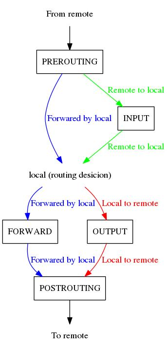

*******************************************
基于OVS多租户的OpenShift网络N板斧——iptables
*******************************************

前言
====

关于iptables本身，本不属于本文的范围。但作为铺垫，为了帮助没有多少iptables经验的技术人员建立一些概念，我决定先讲个比喻。

从前有一棵树，树上长了很多奇异的花，引诱蚂蚁来吸食花粉。有些花粉会让蚂蚁长出翅膀，变成飞蚁，飞到其他地方；而有些花粉会毒死蚂蚁；而有些花粉还会改变蚂蚁的样貌，变成了蝴蝶。树下正好有一个蚂蚁洞，蚂蚁正源源不断地从洞里爬出来，向树上的花爬去。树的主干分出支干，支干有进一步分出支干的支干，蚂蚁们遵循某种规律，在各个节点上选择不同的分支。有的末梢上没有花，于是蚂蚁有得从末梢爬回之前的节点重新选择爬行路线。

这个比喻就是iptables在本机对外发包时对数据包控制的一些类比。其中，蚂蚁代表数据包，花代表iptables的对于数据包所做的最后的ACTION（包括允许数据包“飞”出去的ACCEPT，改变数据包“样貌”的DNAT/SNAT/MASQUERADE，“毒死”数据包的DROP，而没有花的情况则代表着RETRUN，让数据包返回之前的“路径节点”），枝干则代表Chain（链可以彼此衔接，正如一个枝干上又生出其他枝干），而在支干上以及父干与子干间的关节上用于蚂蚁判断是否要从这走的“规律”是Rule。

iptables的Rule和ACTION，通过 *man iptables* 以及 *man iptables-extensions* 就可以查询了，所以这里就略过不再细讲，主要说一说Chain，这也是当需要学习一个环境中的iptables规则，以及维护及测试一个环境时必须掌握的一个关键点。iptables一共提供了五个基础的Chains，来作为所有后续的Chains的根。这五个Chains代表了数据包在被内核协议栈的五个阶段点，分别是 **PREROUTING, INPUT, FORWARD, OUTPUT, POSTROUTING** 。如图:

iptables除了Chain和Rule，还有Table，用于组织Chains。举例来说，nat表是用来做NAT的，它包含除了FORWARD外的四个Chains，因为FORWARD通常用于做转发过滤的；而默认的filter表又不处理NAT，因此也就不包含PREROUTING和POSTROUTING两个Chains。Tables共有5个，filter(default), nat, mangle, security, raw。关于这五个tables，以及更多iptables的细节可以参看:

  - https://www.frozentux.net/iptables-tutorial/cn/iptables-tutorial-cn-1.1.19.html
  - https://www.digitalocean.com/community/tutorials/a-deep-dive-into-iptables-and-netfilter-architecture

集群内访问Service
=================

在OpenShift的OVS多租户网络插件中，iptables主要提供了NAT的功能。需要进行NAT的情况包括:

  1. 集群内的节点访问Service
  2. 集群内的容器访问Service
  3. 外网通过nodePort方式访问Service
  4. 外网通过externalIPs方式访问Service
  5. 计算节点上的容器主动访问外网
  6. 容器以local domain访问Service

从本小节开始，将以此讲解这几种情况，其中1～5将只考虑直接以IP访问的方式。虽然iptables有5个table，但由于主要使用的是nat表，因此以下的内容如不说明，则默认认为是nat表。

参考 `指南 <https://www.frozentux.net/iptables-tutorial/cn/iptables-tutorial-cn-1.1.19.html>`_ ，从集群节点访问Service，也就是以本地为源的包，在经过本地路由后，会经过 *OUTPUT* 和 *POSTROUTING* 链的处理，进行“负载均衡”（选择出目标容器，并将目的IP和Port进行替换，即DNAT）。之后请求包从tun0进入OVS网桥，进入容器的虚拟网络，处理后，应答包会再次从tun0被吐出来。吐出来的应答包在经过conntrack的处理后，做源地址转换，被节点接收。

可以通过命令 *ip r* 来查看路由，假设Service的CIDR是172.16.0.0/16，那么我们将看到类似如下的路由::

    172.16.0.0/16  dev  tun0

而iptables的规则，可以通过命令 *iptables -t nat -S CHAIN* 来查看，CHAIN从根链（本例是 *OUTPUT* ）开始。在”追踪”的过程中，你可以再将 *-j* 后面的子链在替换到 *CHAIN* 来进一步“追踪”。总结后，大概的规则，以及各个链的传接形式如下（以下假设所有的Service的端口都是8080）::

    [a] -A OUTPUT -m comment --comment "kubernetes service portals" -j KUBE-SERVICES
    [b]   -A KUBE-SERVICES -d SERVICE_IP/32 -p tcp -m tcp --dport 8080 -j KUBE-SVC-**
    [c]      -A KUBE-SVC-** -m comment -m statistic --mode random --probability N% -j KUBE-SEP-**
    [d]         -A  KUBE-SEP-** -p tcp -m tcp -j DNAT --to-destination POD_ID:PORT

[a]中， *OUTPUT* 串接 *KUBE-SERVICES* 。[b]中，以具体Service IP和端口为目的的TCP包会被匹配，从而进入以字符串 *KUBE-SVC-* 开头的子链。如果Service有多个后端的Pod，那么在[c]中将进行基于概率统计的随机匹配，随机进入串接某个Pod的子链；而如果Service只有单个Pod，那么就直接进入到Pod的子链。[d]中，匹配到的TCP包会进行DNAT（NAT的结构可以通过命令 *conntrack -L | grep* 来查看）操作，将目的IP和端口转换为Pod的IP和端口。

在离开节点前，数据包会进入到 *POSTROUTING* 链进行处理，并且在我们的场景下，会匹配到如下的规则（假设10.128.0.0/18是Cluster CIDR）::

    -A POSTROUTING -s 10.128.0.0/18 -j MASQUERADE

路由决策阶段所选取的路由，决定了”出口“是tun0，因此数据包源IP就是tun0的IP，属于Cluster CIDR。

*MASQUERADE* action也是NAT的一种操作，会自动获取数据包的”出口“上的IP，并利用该IP来做SNAT。在本例中它没什么作用，因为从本地访问Service，会直接使用tun0的IP。后续将会出现发挥SNAT作用的case。

集群内的容器访问Service
=======================

相比较与集群节点对Service的访问，容器访问Service在iptables上的处理略有不同。因为对节点而言，请求或应答的数据包是经过本地进行转发的，而不是本地产生的。

在这里，补充一下容器的IP和路由。举例来说，假设Cluster CIDR是10.128.0.0/18，容器所在节点的subnet CIDR是10.128.10.0/23，容器的IP是10.128.11.146，那么容器的网卡IP和路由信息大概是::

    ip a:
        eth0: 10.128.11.146/23
    ip r:
        default via 10.128.10.1 dev eth0
        10.128.0.0/18 dev eth0
        10.128.10.0/23 dev eth0
        224.0.0.0/24 dev eth0

从上面的路由信息可以发现，发向Service IP的请求包，将由默认路由匹配，而默认路的下一跳将会是tun0。因此，来自容器的对Service的访问，也是需要经过节点的iptables处理的。首先是 *PREROUTING* 链，在这里会进行如前面所说的“负载均衡”处理。大致的规则形如::

    -A PREROUTING -j KUBE-SERVICES
       -A KUBE-SERVICES -d SERVICE_IP/32 -p tcp -m tcp --dport 8080 -j KUBE-SVC-**
          -A KUBE-SVC-** -m statistic --mode random --probability X% -j KUBE-SEP-**
         [e] -A KUBE-SEP-** -s POD_1_IP/32 -j KUBE-MARK-MASQ
         [f]    -A KUBE-MARK-MASQ -j MARK --set-xmark 0x4000/0x4000
             -A KUBE-SEP-** -p tcp -m tcp -j DNAT --to-destination POD_1_IP:PORT
          ...
          -A KUBE-SVC-** -j KUBE-SEP-** (100%)
         [e] -A KUBE-SEP-** -s POD_N_IP/32 -j KUBE-MARK-MASQ
         [f]    -A KUBE-MARK-MASQ -j MARK --set-xmark 0x4000/0x4000
             -A KUBE-SEP-** -p tcp -m tcp -j DNAT --to-destination POD_N_IP:PORT 

以节点访问Service的iptables规则为基础，这里的规则基本上也是可以同理进行理解的。唯一的区别是[e]和[f]的所代表的内容，它们将匹配以Service后端Pod的IP为源的数据包，匹配到后，将对这样的数据包进行mark标记。这个mark标记只在本地起作用，即当数据包离开本地，被发出时，mark标记将”消失“。不过这个mark标记在容器访问Service这一个case中并为起到作用（因为在后面的 *POSTROUTING* 链中另一条更容易被匹配的规则接管了数据包的处理）。

过完 *PREROUTING* 链后，将进行本地路由，这次也有不同，因为经过“负载均衡“后，数据包的目的地址已经变为了Pod的IP了，因此下面这条路由将会被匹配到（假设Cluster CIDR是10.128.0.0/18）::

    10.128.0.0/18 dev tun0

被本地转发的包，在路由决策后，会进入 *filter* table中进入转发过滤。而OVS多租户插件在 *filter* table中使用的规则很简单::

    -A FORWARD -d 10.128.0.0/18 -j ACCEPT

该规则表示目标IP属于Cluster CIDR 10.128.0.0/18的包会被接受，即允许被转发。能被转发的包，它们的在本机的下一站将是 *POSTROUTING* 链，该链中的规则也很简单::

    -A POSTROUTING -s 10.128.0.0/18 -j MASQUERADE

在前面路由决策的环节，我们已经看到数据包最后会经过tun0”离开“节点，进入OVS的虚拟网络，因此这里用来做SNAT的IP就是tun0的IP。

外网通过nodePort方式访问Service
===============================

这种case与容器访问Service的情况有些类似，毕竟都是经由本地转发。不同的地方在于:

  1. 请求包的目的IP和Port是节点的IP和指定Port，因此需要在 *PREROUTING* 链的子链中进行特定规则的匹配，用来做DNAT
  2. 请求包的源IP不属于Cluster CIDR，因此容器访问case中的 *POSTROUTING* 链中的规则将不会匹配，但仍被其他规则做了SNAT

对于 *PREROUTING* 链及其子链的处理大致如下::

    -A PREROUTING -j KUBE-SERVICES
    [g]-A KUBE-SERVICES -m addrtype --dst-type LOCAL -j KUBE-NODEPORTS
    [h]   -A KUBE-NODEPORTS -m tcp --dport XXX -j KUBE-MARK-MASQ
    [i]      -A KUBE-MARK-MASQ -j MARK --set-xmark 0x4000/0x4000
          -A KUBE-NODEPORTS -m tcp --dport XXX -j KUBE-SVC-**
             -A KUBE-SVC-** -m comment -m statistic --mode random --probability X% -j KUBE-SEP-**
                -A KUBE-SEP-** -p tcp -m tcp -j DNAT --to-destination POD_ID:PORT

通过概率随机地进行负载均衡的部分如同容器访问case中的情况，不同的地方在于:

  - 在[g]中匹配目的IP是节点本地的IP的数据包
  - 在[h]中匹配目的Port是特定端口的TCP数据包
  - 在[i]中对满足匹配（[g]和[h]）的包，进行mark标记，标记为4000

这个mark 4000虽然在容器访问case中（[e]和[f]）没有被使用到，但在本例会发挥作用——用来标记来自外部的流量，而这样的流量将在 *POSTROUTING* 中做SNAT处理::

    -A POSTROUTING -m comment --comment "kubernetes postrouting rules" -j KUBE-POSTROUTING
        -A KUBE-POSTROUTING -m comment --comment "kubernetes service traffic requiring SNAT" \
           -m mark --mark 0x4000/0x4000 -j MASQUERADE

外网通过externalIPs方式访问Service
==================================

同样来自外部的访问，以externalIPs方式进行的访问又稍不同与于nodePort方式，因为请求访问的是一个专门配置的external IP::

    -A PREROUTING -j KUBE-SERVICES
    [j]-A KUBE-SERVICES -d EXTERNAL_IP/32 -p tcp -m comment --comment \
          "NS/SVC:PORT-tcp external IP" -m tcp --dport PORT -j KUBE-MARK-MASQ
    [k]-A KUBE-SERVICES -d EXTERNAL_IP/32 -p tcp -m comment --comment \
          "NS/SVC:PORT-tcp external IP" -m tcp --dport PORT -m addrtype --dst-type LOCAL \
          -j KUBE-SVC-***

[j]中将匹配以external IP和特定端口为目的的TCP数据包，然后串接到 *KUBE-MARK-MASQ* 链中进行mark 4000标记（之后将用于在 *POSTROUTING* 链及其子链中进行SNAT）。[k]中的匹配部分类似，但多了一个，匹配的目标IP，即external IP需要为local IP（即这个IP需要配置在节点的某个网口上，如eth0）。

后续的过程，如同nodePort方式，略过不提。

注意，externalIPs只针对来自外部的访问做了DNAT，而不会针对容器访问外部的流量做SNAT。

计算节点上的容器主动访问外网
============================

对于容器主动访问外网的情况，与节点访问Service的情况又有些类似，不同之处在于访问的外部IP在节点的路由决策阶段，将通过默认路由等直接离开节点，并且这个过程中，仅有 *POSTROUTING* 链会发挥作用::

    -A POSTROUTING -s 10.128.0.0/18 -j MASQUERADE

利用相应”出口“的IP做SNAT。

.. _dns_local_domain_iptables:

容器以local domain访问Service
=============================

容器可以通过local domain的方式访问Service，这种情况下，容器会向节点的DNS服务发起域名解析请求，后者会将请求进一步转发到集群内部的DNS。集群内部DNS的IP为Service网段的地一个IP，例如172.30.0.1。向上游转发的过程中，iptables将发挥作用，将这一指向虚拟IP的请求，转化为指向master节点的请求::

    -A PREROUTING -m comment --comment "kubernetes service portals" -j KUBE-SERVICES
       -A KUBE-SERVICES -d 172.30.0.1/32 -p udp -m comment --comment "default/kubernetes:dns cluster IP" -m udp --dport 53 -j KUBE-SVC-***
          -A KUBE-SVC-*** -m comment --comment "default/kubernetes:dns" -m recent --rcheck --seconds 10800 --reap --name KUBE-SEP-*** --mask 255.255.255.255 --rsource -j KUBE-SEP-***
          -A KUBE-SVC-*** -m comment --comment "default/kubernetes:dns" -m statistic --mode random --probability X% -j KUBE-SEP-***
             -A KUBE-SEP-*** -p udp -m comment --comment "default/kubernetes:dns" -m recent --set --name KUBE-SEP-*** --mask 255.255.255.255 --rsource -m udp -j DNAT --to-destination MASTER_IP:8053

这里忽略了容器以TCP 53端口发起DNS请求的情况，因为二者在iptables上的处理是镜像的。目前还不清楚为什么这里要做成sessionAffinity的。在master节点上，进程 */usr/bin/openshift start master api* 将会监听8053端口。

ClientIP
========

关于Service的“负载均衡”方式，除了Round Robin（即前面所看到的随机）外，还有sessionAffinity和custom方式。custom方式，我目前还没有尝试，这里讲一下sessionAffinity。其过程与Round Robin方式类似，不同点在于iptables会为Service后端的每一个Pod所对应的Chain设置一个队列，而当数据包进入Service的Chain后，会在各个Pod的Chain中去查询队列，如果在某个队列中查看到了该数据包的源IP，则直接匹配；否则，会通过随机进行匹配，被匹配的Pod链会将数据包的源IP加入到队列中，用于后续匹配。队列会有老化时间，用于将队列中的IP踢出。相关的iptables形如::

    -A KUBE-SVC-** -m recent --rcheck --seconds 10800 --reap --name KUBE-SEP-*** \
       --mask 255.255.255.255 --rsource -j KUBE-SEP-***
    -A KUBE-SVC-** -m recent --rcheck --seconds 10800 --reap --name KUBE-SEP-*** \
       --mask 255.255.255.255 --rsource -j KUBE-SEP-***
    -A KUBE-SVC-** -m statistic --mode random --probability 0.50000000000 -j KUBE-SEP-***
    -A KUBE-SVC-** -j KUBE-SEP-***
