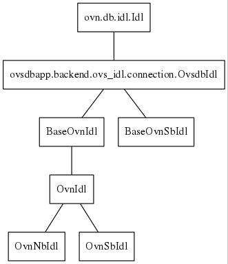

.. _get_ovn_idls:

***************************
Neutron OVN driver get idls
***************************

In networking_ovn.ml2.mech_driver.OVNMechanismDriver, it gets OVN idls via::

  post_fork_initialize
      self._post_fork_event.clear()
      self._nb_ovn, self._sb_ovn = impl_idl_ovn.get_ovn_idls(self, trigger)
      self._post_fork_event.set()

and get_ovn_idls is defined in networking_ovn/ovsdb/impl_idl_ovn.py::

  def get_ovn_idls
      def get_ovn_idl_retry(cls):
          cls(get_connection(cls, trigger, driver))
      return tuple(get_ovn_idl_retry(c) for c in (OvsdbNbOvnIdl, OvsdbSbOvnIdl))

  def get_connection(db_class, trigger=None, driver=None):
      # The trigger is the start() method of the worker class
      if db_class == OvsdbNbOvnIdl:
          args = (cfg.get_ovn_nb_connection(), 'OVN_Northbound')
          cls = ovsdb_monitor.OvnNbIdl
      elif db_class == OvsdbSbOvnIdl:
          args = (cfg.get_ovn_sb_connection(), 'OVN_Southbound')
          cls = ovsdb_monitor.OvnSbIdl
  
      if trigger and trigger.im_class == ovsdb_monitor.OvnWorker:
          idl_ = cls.from_server(*args, driver=driver)
      else:
          if db_class == OvsdbSbOvnIdl:
              idl_ = ovsdb_monitor.BaseOvnSbIdl.from_server(*args)
          else:
              idl_ = ovsdb_monitor.BaseOvnIdl.from_server(*args)
      return connection.Connection(idl_, timeout=cfg.get_ovn_ovsdb_timeout())

(cfg.get_ovn_ovsdb_timeout will return 180(sec) by default.)

OvsdbNbOvnIdl will be discussed in :ref:`next topic <nb_idl>`, and
connection.Connection will be discussed in :ref:`idl ovsdb_connection
<idl_ovsdb_connection>`.
So what's the OvnNbIdl, OvnSbIdl, BaseOvnSbIdl, BaseOvnIdl, what's the
relationship between them?
They can be found in networking_ovn/ovsdb/ovsdb_monitor.py, and their
inheriting relationship looks like

    
No matter OvnNbIdl, OvnSbIdl, BaseOvnIdl, BaseOvnSbIdl, they all rootly
inherit from ovs.db.idl.Idl, which can be considered as message level interface
to server. The only difference including:

- tables register in ovs idl
- watching event and event notify handler

OvsdbNbOvnIdl and OvsdbSbOvnIdl are different, since they:

- directly use the above idls to do message transimition
- implement commands for northbound user to operate
- have other works to handle commands transaction

The following two tables try to explain when and how they are

    +---------------------+---------------+---------------+
    |       _*b_ovn       |     N         |      S        |
    +---------------------+---------------+---------------+
    | API and RPC workers |               |               |
    +---------------------+ OvsdbNbOvnIdl | OvsdbSbOvnIdl |
    | ovn-worker          |               |               |
    +---------------------+---------------+---------------+
    
    +------------------------------+---------------+--------------+--------------------------+
    | _*b_ovn.ovsdb_connection.idl |      N        |      S       | register event notify    |
    +------------------------------+---------------+--------------+--------------------------+
    |     API and RPC workers      |  BaseOvnIdl   | BaseOvnSbIdl |    no need               |
    +------------------------------+---------------+--------------+--------------------------+
    |          ovn-worker          |   OvnNbIdl    |  OvnSbIdl    | LSP for N, chassis for S |
    +------------------------------+---------------+--------------+--------------------------+

as above shown:

1. no matter for API and RPC workers, or for ovn-worker, idl will be
   OvsdbNbOvnIdl for northbound and OvsdbSbOvnIdl for southbound.
2. for API and RPC workers, _*b_ovn.idl.ovsdb_connection.idl will be BaseOvnidl
   for northbound and BaseOvnSbidl for southbound. They just need register
   tables then start connection.
3. but for ovn-worker, _*b_idl.ovsdb_connection.idl will be OvnNbIdl for
   northbound and OvnSbIdl for southbound. The two both inherits from OvnIdl,
   which has notify and notify_handler. For northbound, OvnNbIdl need monitor
   lsp create/update up/down events, and for southbound, OvnSbIdl need monitor
   chassis event.

More about ovn-worker can be find in `networking-ovn design ovn_worker
<https://github.com/openstack/networking-ovn/blob/master/doc/source/contributor/design/ovn_worker.rst>`_.
