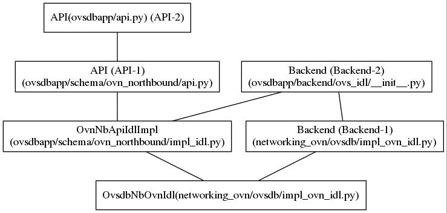

.. _nb_idl:

**********************
Neutron OVN client idl
**********************

Continue to :ref:`last topic <get_ovn_idls>`, this one will try to do some
diging on OvsdbOvnIdl, the OVN client idl for server, from two aspects,
its __init__ and transaction methods.

IMO, its transaction method is important to dig, since for Neutron ML2 driver,
operations to server, is always terminated at transaction [1], like::

    with self._nb_idl.transaction(check_error=True) as txn:
        txn.add(...)

OvsdbOvnIdl superclasses
========================

To figure out what does its initilize method do, we need find out its
superclasses first.
As previous :ref:`topic says <get_ovn_idls>`, OvsdbNbOvnIdl has different
superclass than idls like BaseOvnIdl, its inheritation map looks like

and we can find OvsdbNbOvnIdl.__mro__ is: OvsdbNbOvnIdl, OvnNBApiIdlImpl,
Backend-1, Backend-2, API-1, API-2. And
Backend-2 defines:

  - start and restart connection methods
  - commands to operate db, table, record commonly

API-2 defines:

  - transaction method and other abstract methods about db operation like
    db_list, db_add.

API-1 defines:

  - abstract methods to operate OVN_Northbound DB, like ovn-nbctl

Backend-1 defines:

  - method to start connection, and create transaction, and is_table_present,
    is_col_present, idl

OvnNbApiIdlImpl defines:

  - methods defined by API-1.

.. _nb_idl_init:

OvsdbOvnIdl.__init__
====================

After extract code pieces from its parents, OvsdbNbOvnIdl __init__ looks like::

    OvsdbNbOvnIdl
        __init__
            self.ovsdb_connection = connection
            self._nested_txn = None
            self.start_connection(connection)
            self.idl._session.reconnect.set_probe_interval(
                cfg.get_ovn_ovsdb_probe_interval())

and where self.idl and start_connection is::

    idl
        return self.ovsdb_connection.idl

    start_connection
        self.ovsdb_connection.start()

set_probe_interval will reset probe interval for session build on the
connection for keepalive purpose, which is done by sending "echo" message.
_nested_txn is a transaction object yield by OvsdbNbOvnIdl.transaction method.
ovsdb_coonnection.start() will start a thread which handling transaction
submitted via [1], more about this will be discussed in :ref:`idl
ovsdb_connection <idl_ovsdb_connection>`. [2]

OvsdbNbOvnIdl.transaction
=========================

Get transaction
---------------

The main entrace for ovn_client to call transaction is [1], and that's also the
place where transaction get created::

    transaction
        if self._nested_txn:
            yield self._nested_txn
        else:
            with self.create_transaction(check_error, log_errors,
                                         **kwargs) as txn:
                self._nested_txn = txn
                try:
                    yield txn
                finally:
                    self._nested_txn = None

where create_transaction is::

    create_transaction(self, check_error=False, log_errors=True)
        return idl_trans.Transaction(
            self, self.ovsdb_connection, self.ovsdb_connection.timeout,
            check_error, log_errors)

So every time [1] is called, if an idl_trans.Transaction object is created
already, it will be returned to make sure all operations commands can be
submitted into the same transaction to server.
idl_trans.Transaction is in ovsdbapp/backend/ovs_idl/transaction.py and
inherits from ovsdbapp.api.Transaction. For with statement in [1], its
relative methods are defined like::

    __init__
        self.commands = []
        self.results = Queue.Queue(1)
        self.ovsdb_connection = ovsdb_connection

    __enter__
        return self
    
    __exit__
        if exc_type is None:
            self.result = self.commit()

    add(self, command)
        self.commands.append(command)
        return command

.. _transaction_commit:

Transaction commit
------------------

txt.add only collect commands, and when transaction exits, commit method is
called to put transaction itself into ovsdb_connection's transaction queue,
and wait ovsdb_connection to handle, as [2] mentioned::
        
    commit
        self.ovsdb_connection.queue_txn(self)
        try:
            // timeout: 180s by default, from ovsdb_connection.timeout
            // wait an item is available or raise Empty when timeout
            result = self.results.get(timeout=self.timeout)
        except Queue.Empty:
            raise exceptions.TimeoutException(commands=self.commands,
                                              timeout=self.timeout)
        ...
        return result

And idl_trans.Transaction also defines a callback method for ovsdb_connection
thread to handle operation commands in transaction::

        do_commit
            // Transaction: ovs.db.idl.Transaction
            // self.api.idl: _nb_idl.ovsdb_connection.idl
            txn = idl.Transaction(self.api.idl)
            for i, command in enumerate(self.commands):
                command.run_idl(txn)    // command execution entrance
            status = txn.commit_block()
            if status == ...
            elif status == txn.SUCCESS:
                self.post_commit(txn)
            return [cmd.result for cmd in self.commands]

as shown, when ovsdb_connection thread start to process transaction,
commands in transaction will be processed via them run_idl methods one by one.
Once commits are OK, ovsdb_connection thread will put results of
transaction into transaction results queue for further process.
