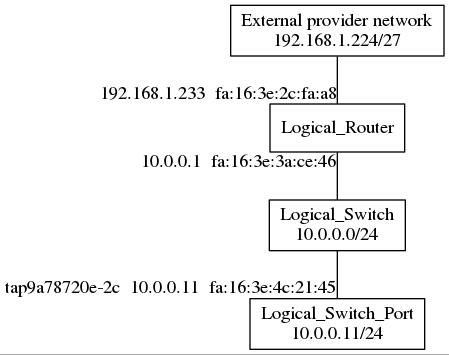

L3 egress traffic
*****************

In this topic, I would like to do some digging in OVN L3 egress traffic, with
the following targets:

  - ARP, how is a MAC of an external network IP get by OVN
  - SNAT
  - HA or distributed supporting

About my environment, I use devstack, build a 2 nodes environment, including
one all-in-one, one compute node.

Currently, devstack will create systemd scripts like devstack@ovn-northd for
OVN, for Ubuntu, they can be found under /etc/systemd/system/. And for logs of
OVN relavant processes, since OVS_LOGDIR has been overrided in systemd scripts,
so they no longer exist in legacy path, like /usr/local/var/log/openvswitch/.

Useful flow trace commands
==========================

There are three useful commands can help tracing flow/logical-flow for packet
processing in OVN, *ovs-appctl ofproto/trace*, *ovn-trace*, and *ovn-detrace*.
Their usages look like::

    ovs-appctl ofproto/trace br-int in_port="DEVICE",icmp,dl_src=MAC,\
        dl_dst=MAC,nw_src=IP,nw_dst=IP,nw_ttl=64
    ovn-trace LS.uuid "inport == \"LSP.name\" && eth.dst == MAC &&
        eth.src == MAC && ip4.src == IP && ip4.dst == IP && ip.ttl == 64"
    ovn-detrace < FILE

The first one is an ovs traditional one, it directly traces on ovs flows. For
DEVICE, you can use::

    ovs-vsctl find interface external_ids:iface-id=NEUTRON.PORT_ID | grep "^name"
    or
    ovs-vsctl find interface external_ids:vm-id=NOVA.INSTANCE_ID | grep "^name"

to find.

The second one is an ovn version, it traces on OVN logical flows in OVN SB DB.

For the third one, you can find it in
http://openvswitch.org/support/dist-docs/ovn-detrace.1.pdf. It's really good
to use when you need to check ovs flows and logical flows together.

To trace L3 egress traffic with above commands, variables should be set with:

  - dl_src => instance NIC mac
  - dl_dst => subnet gateway on which instance is booted
  - nw_src => IP of instance
  - nw_dst => external IP
  - for logical router forwarding, nw_ttl should be larger than 1, otherwise
    it will be droped

additionally, ICMP type and code can be used to identify that it is ICMP
traffic. For icmp request, adding:

  - icmp4.type == 8
  - icmp4.code == 0

for ovn-trace command, and only "icmp" is needed for ovs trace command.

Tracing in flows
================

In my environment, topology of nova instance(logical switch port), logical
switch, logical router and external provider network looks like

"tap9a78720e-2c" is the name of tuntap device for nova instance.
And on external provider network, there is a node with IP 192.168.1.254, will
be used for nova instance to ping for a test later.

First, we can use the following commands to get a overview of packet path in
OVN::

    sudo ovs-appctl ofproto/trace br-int in_port="tap9a78720e-2c",icmp,\
        dl_src=fa:16:3e:4c:21:45,dl_dst=fa:16:3e:3a:ce:46,nw_src=10.0.0.11,\
        nw_dst=192.168.122.254,nw_ttl=64 > tmp
    ovn-detrace < tmp

From output of the above commands, we can see packet will go through flows in
order:

  - logical switch ingress pipeline
  - logical switch egress pipeline
  - logical router ingress pipeline
  - logical router egress pipeline
  - provider network ingress pipeline
  - provider network egress pipeline

once packet leaves provider network egress pipeline, it will leave ovs
integration bridge(br-int) and enter provider network bridge(br-ex for
OpenStack). At that point, all processing of OVN on it can be considered as
completed.

L2 Flow control, such as security detection, ACL, and DHCP and DNS response
will not be discussed here.

lr_in_ip_routing
----------------

In logical router ingress pipeline, table lr_in_ip_routing, packet will:

  1. decrease its TTL since forwarded
  2. set NXM_NX_XXREG0[96..127] with destination IP address
  3. set NXM_NX_XXREG0[64..95] with nexthop IP, router gateway port IP address
     on external provider network
  4. set ether source address with router gateway port MAC address
  5. set router gateway port as outport
  6. set flags.loopback to as enabled

the 2nd to 5th operations can be easily understood, they are all prepared for
egress, since once packet IP destination matches, port for output can be
determined.

About `flags.loopback
<http://openvswitch.org/support/dist-docs/ovn-sb.5.pdf#page=14&zoom=auto,-268,463>`_
, it says to allow packet send back to inport. That's interesting and
necessary, one possible scenario is, a logical switch LS atteched onto two
logical routers, A and B. A holds the default route gateway for LS, and B can
access a special external provider network SN, while A cannot. So for instances
on LS whom don't add a route for SN, packets aiming to SN will be always sent
to A. For this reason, after lr_in_ip_routing processing, A need allow packets
send back to ports from where they enter, since A may know the nexthop for SN
is another port on LS.

lr_in_arp_resolve
-----------------

After processing in table lr_in_ip_routing, packet will be resumitted into
table lr_in_arp_resolve, for an egress packet, since it targets to an "unknown"
destination for OVN, so flows created for any inner CIDRs or logical switches
will not work for it. As a result, default flow with the following processing
will work for packet:

  - set NXM_NX_REG0[] with value cached in NXM_NX_XXREG0[96..127], and keep
    original value in NXM_NX_REG0[] in stack.
    (Since NXM_NX_XXREG0[96..127] has been set with destination IP in table
    lr_in_ip_routing, this will cause NXM_NX_REG0 to store destination IP
    temporarily)
  - set destination MAC address to 00:00:00:00:00:00 since unknown for now
  - resubmit pachet to `table OFTABLE_MAC_BINDING(number is 66)
    <https://github.com/openvswitch/ovs/blob/master/ovn/controller/lflow.h#L59>`_
    . In table OFTABLE_MAC_BINDING, by matching destination IP cached in
    reg0/NXM_NX_REG0[], related MAC address will be set as packet destination
    MAC, after that, packet will be "sent back" to table lr_in_arp_resolve.
  - revert NXM_NX_REG0[] value back to original one.
  - resubmit packet to next table, lr_in_gw_redirect.

("sent back": TBH, I'm not sure whether it is like that, and how it works,
 what a shame)

Process resubmit to table OFTABLE_MAC_BINDING is defined by `action get_arp
<http://openvswitch.org/support/dist-docs/ovn-sb.5.pdf#page=17&zoom=auto,-268,754>`_
. Action get_arp mentions "Looks up A in P’s mac binding table.", the
table is `MAC_Binding table in OVN Southbound DB
<http://openvswitch.org/support/dist-docs/ovn-sb.5.pdf#page=29&zoom=auto,-268,754>`_
, and can be checked with::

    ovn-sbctl list mac_binding

**MAC_Binding** describes how actions get_arp, arp, put_arp will be used to
resolve an unknown MAC address for OVN, I strongly suggest you to read.

MAC_Binding works in a limited workspace, only for a certain logical router
port. So for a certain IP on external provider network, different logical
routers which having gateway ports on that network will have to send several
ARP requests to get relevant MAC address for the sname IP. As a result,
mulitple similar rows in MAC_Binding table will be created, but just with
different logical_port. It's possible to merge them into one by changing column
logical_port to logical_ports to work as a list of logical_ports, but I'm not
sure whether it is worth  to do.

Another point of MAC_Binding is, once logical router is updated with setting
enabled to false, records in MAC_Binding related to its logical router ports
will be erased. This can be triggered via updating router admin_state_up state
in OpenStack.

The above discusses case for external IP-MAC binding already exists, for an
external IP with unknown MAC, will be discuessed later.

lr_in_gw_redirect & chassis_redirect
------------------------------------

In table lr_in_gw_redirect, outport for packet will be set to a new one, whos
name equals to original outport name adding a prefix "cr-" which stands for
`"chassis redirect"
<https://github.com/openvswitch/ovs/blob/master/ovn/northd/ovn-northd.c#L875-L879>`_
, for all-in-one node case, this is just a temporary changing, it will be set
back to orignial value in table 33(OFTABLE_LOCAL_OUTPUT) via setting `reg15
<https://github.com/openvswitch/ovs/blob/master/ovn/lib/logical-fields.h#L36>`_
. The new "cr-" prefixed logical port can be found in Port_Binding table, but
not in Logical_Router_Port table or Logical_Switch_Port table, since it is a
chassis relavant logical port, not a one from northbound/CMS.

For compute node case, where "centralized SNAT gateway port" is not in current
node case, chassis redirect node will cause packet be redirected to chassis
which hosts centralized SNAT gateway port. Indeed, I'm not sure whether it
should be called as centralized SNAT gateway port, or ports. If active-backup,
how will previous existing port mapping for SNAT won't be lost after AB
down/upgrade; multiple active, is that possible?

An interesting point I found in chassis redirecting case is action bundle, used
in ovs flow table 32, table transmiting to remove chassis. Action bundle can
be found in `ovs-ofctl manpage
<http://openvswitch.org/support/dist-docs/ovs-ofctl.8.pdf#page=19&zoom=auto,-16,553>`_
or `comments in code
<https://github.com/openvswitch/ovs/blob/master/lib/ofp-actions.c#L1265-L1310>`_
. Algorithms used by action bundle, active_backup and HRW can be found in
`ofp-actions.h
<https://github.com/openvswitch/ovs/blob/master/include/openvswitch/ofp-actions.h#L339-L360>`_
. And OVN uses active_backup in table 32(can be checked in `physical.c
<https://github.com/openvswitch/ovs/blob/master/ovn/controller/physical.c#L680-L711>`_
), which means there can be multiple remote ofports to work as distributed
router gateway ports. In my environment, I have only two chassis, so there
is only one "remote" ofport, one more chassis is needed to test/verify multiple
remote ofports case later.

But it's still confused to me, I have two chassis, both have external bridge
configured to connect external provider network, so why:

  1. how does a chassis can be considered as gateway port can be bound on
  2. how does a chassis be selected as north edge for egress traffic
  3. how are the "slaves" determined
  4. where they are filled into list in flow and how one is selected.

STOPED AT HERE
--------------

About why outport needs to be temporarily changed, I'm not sure yet, I tried
to find some info from `table 33 in ovn-architecture
<http://openvswitch.org/support/dist-docs/ovn-architecture.7.pdf#page=10&zoom=auto,-268,794>`_
, but not helpful for me. :(

Later I found some comments in
https://github.com/openvswitch/ovs/blob/master/ovn/controller/physical.c#L371-L378
, it sounds like a the original outport, who stands for router gateway port
on current chassis is a distributed replication one for this chassis, that may
explain why it needs to change from chassis redirect port to the original
outport.

Let's back to see about changing logical outport to chassis-redirect port.

ARP discovery
-------------

HA/Distributed ?
----------------

Not see yet. I did a test by deleting physical NIC from br-ex on all-in-one
node, and ping another exnternal IP from instance on all-in-one node. And my
compute node also has external provider network configured, has br-ex bridge
with physical NIC attached.

I checked tables Port_Binding and Gateway_Chassis, ensuring that chassis
resident logical router port bound to both two chassis. But ARP packets only
send to br-ex on all-in-one node, but not to compute node via tunnel. Seems
not work like `MAC_Binding
<http://openvswitch.org/support/dist-docs/ovn-sb.5.pdf#page=29&zoom=auto,-268,689>`_
described.
