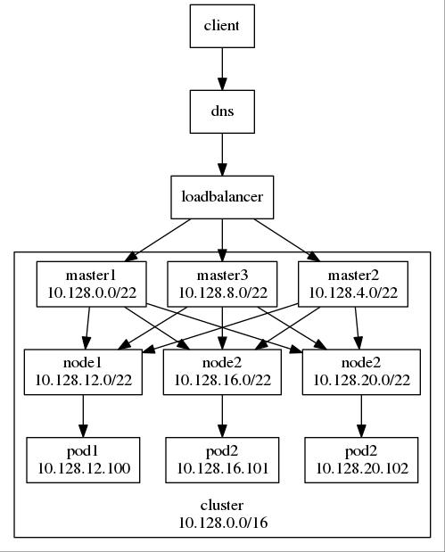
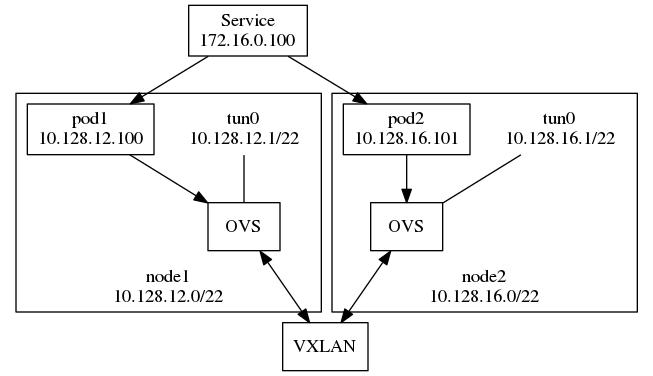
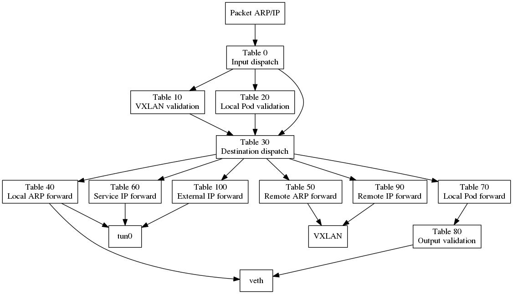
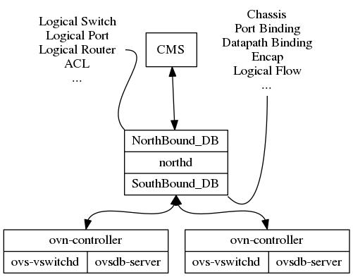

********************
OVS 在云项目中的使用
********************

本文将尝试讲解OVS在OpenStack, OpenShift项目中的使用情况，以及简单介绍OVS的子项目OVN。(由于缺乏对社区的跟进，因此对OpenStack Neutron掌握的信息基本上是截至的M版的，对OpenShift截至到1.5.1版本的，对OVN的掌握是截至到OVS2.6版本)

一般而言，在项目上使用OVS，主要需要考虑以下点:

  - 基础网络拓扑如何构建:

    - 虚拟网卡如何接入到OVS
    - OVS是否需要处理虚实边界
    - 是否需要打通大二层
    - ...

  - 虚拟设备的流量/数据包如何控制，即flow如何设计

在OpenStack中，关于虚机是如何接入以OVS, netns, iptables为基础的虚拟网络，以及虚机的各种方向上的流量通路，我相信这方面的资料基本上在网上已经烂大街了，所以不是讲解的重点。

对于本文介绍的铺垫，在这里只提以下几点:

  1. 接线。虚机以何种方式接入到OVS网桥，OVS并不关心，对于OVS而言，它们都是网桥上的port；
  2. 租户隔离。port可以配置tag，以实现租户网络的隔离，tag也可以称之为local VLAN。OVS local VLAN的边界是在单个计算节点上，但是这个边界可以延伸出去:

     - 以VLAN转换的方式直接对接物理网络的VLAN;
     - 通过将local VLAN与VXLAN VNI（VXLAN Network Identifier）做映射，以实现不同计算节点上的不同local VLAN在逻辑上是属于同一个"local VLAN"，这也是大二层实现的基础;

  3. 转发控制。以flow来控制虚机数据包的转发路径，包括VLAN转换，安全组，ARP待答等;

上面的点同样可以套用到OpenShift上，只不过在OpenShift中:

  1. 以OVS的数据包标记数据reg/register，来实现租户隔离，而非tag;
  2. 转发控制，仅仅控制数据包如何被转发，而没有安全组，ARP等功能。这些是由容器服务的场景所决定的。

OpenShift的相关知识铺垫
=======================

在OpenShift中，OVS差不多算是底层的driver，而调用这个driver的plugin叫做redhat/openshift-ovs-multitenant，即OVS多租户插件。

为了更有意义的展开，需要先介绍一下K8S的CNI(Container Network Interface)，K8S自己没有自己直接实现网络组件，而是提供了CNI，用来统一为容器平台提供网络服务的插件规范，包括以下三条:

  1. 集群内所有容器间的通信无需通过NAT转换。
  2. 所有集群节点与集群内容器间的通信无需通过NAT转换。
  3. 外界所见容器的IP地址与容器自身所见的IP地址保持一致。

个人理解，这三点是为了达到简化网络模型的目的。毕竟用户真正需要关心的是如何在容器上如何串联自己的服务，而不是网络的连线:

  - 所有的容器IP都是容器平台分配并配置的，无需用户参与。因此，整个容器网络对于平台而言，用一个“内网”足以解决，而内网互通是不需要NAT的;
  - 节点和容器上的服务可能会互访，因此节点也需要接入容器的虚拟网络中。既然存在一个port接如容器网络中了，那么与其做NAT，比如直接为这个port配置“内网”的IP;
  - 相应的，在集群的边界上需要做NAT。但这个配置也不是需要用户过多操作的。

（OpenShift中基础的网络逻辑）

为了实现这几点，所有的K8S网络插件都需要做到:

  - 定义一个大的cluster CIDR，所有的容器IP都属于这个cluster CIDR中
  - 在计算节点上，需要创建一个点并连接到虚拟网络，这个点上配置属于cluster CIDR的IP
  
    - OVS多租户插件为此在每个节点上都创建了一个OVS internal port，名为tun0

  - 在集群的节点上，利用iptables做NAT，方便容器从集群的任意一个节点都能访问外部

此外，不确定是否是历史原因，集群中的计算节点将cluster CIDR分割成了若干个等大的子网，每个计算节点各占据一个子网，并且每个节点上都有一个端口配置了子网网管用来与容器通信:

  - 可能的历史原因是在docker提供的一种网络类型中，LinuxBridge docker0需要配置成本地容器网络的网关
  - 这样的便利是:

    - **当数据包在转发时，只需要查看目的IP，就可以知道目标容器在哪个节点上**
    - **各个节点上，对于虚拟网络，只需要记录子网与节点的对应关系，就可以完成精准的“远程投递”，而不要（当然也不可能）记录完整的容器IP与节点绑定的完整拓扑**

  - OVS多租户网络为tun0配置了节点的cluster subnet的网关IP。如此，容器对外网的访问数据包，下一跳到了子网网关，就到了tun0，就到了虚实边界，从而在节点上通过NAT，就可以直接出去了。

OVS在虚拟网络拓扑构建上做的东西不多，剩下的工作基本都在flow上了。在进一步讲解flow之前，再需要补充一个K8S的知识点—— Service，Service用来解决:

  - 容器的生死比虚机来的更频繁，而每一次都伴随着IP的变更，因此在容器上的构建的服务不能以IP作为配置去串联前后端
  - 同一个服务的前后端，可能分别由多个容器组成，前后端的对接需要负载均衡

并且实际上，Service无论在功能逻辑还是在底层实现上，看起来也都像一个LB。Service“监听”的IP相对于容器的IP更稳定，而K8S的服务发现机制又可以保证与Service相关的容器的IP能及时的加入到Service的后端中。具体到底层实现，OpenShift集群中，每个节点上都会通过iptables在nat表中配置规则来随机选择“后端”的容器，来负载分发。

.. _openshift_ovs_flows:

OpenShift OVS flows
===================

以下对OVS的flows进行讲解。基本的逻辑概括起来就是:

  - table 0: 做入口分流，来自VXLAN隧道/本节点的容器/其他节点的流量分别分流到table 10/20/30；
  - table 10: 做入口合法性检查，如果隧道的远端IP是集群节点的IP，就认为是合法，继续转到table 30去处理;
  - table 20: 做入口合法性检查，如果数据包的源MAC和IP等数据与来源端口（veth）一致，就认为是合法的，设置源项目标记，继续转到table 30去处理；如果不一致，即可能存在ARP/IP欺诈，则认为这样的的数据包是非法的;
  - table 30: 做数据包的目的（目的IP或ARP请求的IP）做转发分流，分别转到table 40~70 去处理;
  - table 40: 本地ARP的转发处理，根据ARP请求的IP地址，从对应的端口（veth）发出;
  - table 50: 远端ARP的转发处理，根据ARP请求的IP地址，设置VXLAN隧道远端IP，并从隧道发出;
  - table 60: Service的转发处理，根据目标Service，设置目标项目标记和转发出口标记，转发到table 80去处理;
  - table 70: 本地IP的转发处理，根据目标IP，设置目标项目标记和转发出口标记，转发到table 80去处理;
  - table 80: 做本地的IP包转出合法性检查，检查源项目标记和目标项目标记是否匹配，或者目标项目是否是公开的，如果满足则转发;
  - table 90: 做远端IP包转发“寻址”，根据目标IP，设置VXLAN隧道远端IP，并从隧道发出;
  - table 100: 做出外网的转出处理，将数据包从tun0发出。

以下将针对各个table稍作展开，其中会使用伪代码来表述流表逻辑，而不是直接使用OVS flows。

::

  table 0
    from vxlan, set tun_id to reg0                      => table 10
    from tun0                                           => table 30
    from vethXX                                         => table 20

在table 0中做了流量入口判断和分流，这是成熟项目的标识:

  - 从VXLAN tunnel过来的，集群中其他节点上的数据包，将VXLAN VNI存入数据包的OVS标记字段regsiter 0中（在后面的flows中，我们将看到reg0中寄存的数据包来源的项目标记，即从哪个项目来），之后转入table 10进行入口合法性检查
  - 其他入口不是VXLAN tunnel或tun0的ARP或者IP数据包，可以认为是来自容器的包，即来自veth peer，转入table 20进行入口合法性检查
  - 如果是从tun0中来的则直接转入table 30，并不需要做入口合法性检查，因为来自本地节点或进本地节点转发（来自外部网络）的包都默认是合法的

（关于VNI与register需要补充的是，OVS的register是32为的，而VNI只有24位，为了对齐，OVS多租户插件选择用register的低24位来寄存租户标记，及租户标记是24位的，足够大了）

::
  
  table 10
    match tun_src                                       => table 30

对于来自VXLAN tunnel的包，进一步判断隧道的源IP是否属于OpenShift集群，如果是，则进入table 30处理，否则drop。

::

  table 20
    for arp, match in_port, arp_spa, arp_sha, set reg0  => table 21
    for ip,  match ip_port, nw_src,  set reg0           => table 21
  
  table 21 => table 30

来自容器的包，判断其来源是否合法，如果是，则先为其设置来源项目标记(reg0)，然后进一步转入table 30，否则drop。

::
  
  table 30
    for arp, match arp_tpa, if local subnet gateway IP  => output:2
                            if IP in local subnet       => table 40
                            if cluster cidr             => table 50
    for ip,  match nw_dst,  if local subnet gateway IP  => output:2
                            if IP in local subnet       => table 70
                            if cluster cidr             => table 90
                            if service IP cidr          => table 60
             in_port=1, nw_dst=224.0.0.0/4              => table 120
             nw_dst=224.0.0.0/4                         => table 110
             priority=0                                 => table 100

在基于入口分流的合法性检查通过后，数据包的处理会汇流到table 30，进行目的判断，为转发做基础:

  - 在这里，如果数据包的目标IP是subnet的网关IP，那么直接从tun0发出，因为也没什么需要进一步做的检查了
  - 对于ARP，目标IP是本地容器的或者非本地容器的，会转到table 40或50去处理
  - 对于IP包，

    - 如果是访问本地容器的，则转到table 70
    - 如果是其他节点上的容器，则转到table 90
    - 如果是访问Service，则转到table 60
    - 如果是访问外网的，这转到table 100，在table 100中直接通过tun0进入节点，进一步做NAT出去
    - 否则drop

::

  table 40
    arp, match arp_tpa, output:X                        => vethX

  table 50
    arp, match arp_tpa, set reg0 to tun_id, set tun_dst => output:1

对于ARP数据包，目标在本地的，通过检查目标IP从而得知目标容器的端口，从而转发出去。而对于目标IP不在本地的，通过目标IP的CIDR，判断出远程节点，将目标项目的标记记存入VXLAN VNI中，通过VXLAN隧道发向对应节点。（发往远端的包虽然将项目标记设置成了tunnel_id，及VXLAN VNI，但是对端的处理实际上是会忽略项目标记的，这么做只是为了在table 0中，做入口分流的时候，能够统一对收到的远程访问的数据包的处理）

::
  
  table 60
    tcp, match nw_dst, tp_dst, set reg1, reg2           => table 80

对于目标是Service的数据包，则设置目标项目标记（reg1），并将转发出口标记（reg2）为2，即tun0。（在table 80中会进行转发合法性检查，如果访问源和Service在不同的项目中，请求包将被drop掉。合法的包会通过tun0进入的节点，经过iptables的负载均衡后，目标IP变为某一容器的IP，之后数据包会再次通过tun0回流到OVS虚拟网络中，并从table 0开始重新进行转发。

::

  table 70
    ip, match nw_dst, set reg1, reg2                    => table 80

对于目标IP是本地容器的IP数据包，通过检查其目标IP来设置reg1（目标IP所属的项目标记），同时将目标IP对应的容器的端口ID设置为reg2（转发出口标记）。

::
  
  table 80
    prio=300, ip, nw_src is local subnet gateway IP     => output:REG2
    prio=200, reg1=0                                    => output:REG2
    prio=100, reg1=SHARED                               => output:REG2
    prio=100, match reg0 == reg1                        => output:REG2

在本地转发前，进行转发合法性检查，对于容器间的访问，**如果数据包的源与目的项目标记相同，或者目的项目的标记是共享的，则转发合法** （这也就是OpenShift中OVS多租户插件实现租户网络隔离的方法，但其实与其说是租户网络隔离，不如说是项目网络隔离，因为一个用户是可以创建多个项目的）。来自节点的访问，以及向集群服务（如DNS）发起的访问（reg1=0）也是合法的。对于合法的转发，数据包将会从reg2，即转发出口标记所指向的端口发出。

::
  
  table 90
    ip, match nw_dst(remote subnet), set reg0 to tunnel id, set tun_dst => output:1

对于转发到远端的包，检查目标IP从而判断出对应的节点，将目标项目标记设置到VXLAN VNI，然后通过VXLAN隧道发向对应的节点。

OVS in OpenStack
================

想比较与OpenShift，OpenStack的网络较为复杂。首先，OpenStack提供的是虚机服务，因此从虚机里发出来的数据包的情况更为复杂一些，并且用户自助式的服务更多一些，因此当用户自己配置虚拟网络拓扑时，产生的变数也更多一些，对OVS等网络基础固件提出了较多的技术需求。

以下主要针对KVM环境，对于VMWare环境，我相信会有更好的技术方案去实现，所以再次不进行讨论。

OpenStack为了构建虚拟网络，使用了多个网桥:

  - br-int: 

    - 集成网桥，或者说是“插线板”，所有虚机都会加入到这个网桥;
    - 在这个网桥上，目前我们使用的到流表很简单，数据包只要过了ARP和MAC的防欺诈处理后，就利用vSwitch的NORMAL action来转发了。

  - br-tun:

    - 隧道网桥，当租户网络类型中有隧道类型时，会使用到这个网桥;
    - 与br-int通过patch port，即直连网线相连接;
    - 在br-tun上的流表比br-int上的相比，些许复杂一些，因为:

      - 这里要处理隧道边界，例如VNI与local VLAN的转换;
      - 对于单播，需要知道明确的隧道对端，才能将数据包通过隧道发出;
      - 对于多播/广播，需要对所有具有同租户网络虚机的远程主机发出数据包;
      - 当开启ARP待答功能时，需要在这里构造ARP相应包;

  - br-vlan:

    - VLAN网桥，服务于VLAN类型的租户网络;
    - 对于完全的OVS VLAN方案，虚实网络的VLAN边界在这里，物理网络VLAN与OVS local VLAN的转换在这里处理;
      （那么相对的，也有不完全的OVS VLAN方案，即虚实VLAN的边界不在这里。在那种方案中，VLAN的边界维持在特定的网桥上，而VLAN的转换则是通过在特定网桥上桥接的VLAN子接口来做的。）

在OpenStack中，OVS这种相对复杂的设计，主要是为了适应不同的场景需求，而做的通用性妥协。例如对于纯VLAN环境，完全可以做到虚实VLAN ID保持一致，并且只用一个网桥就可以满足需求。

OVS/OVN
=======

OVN，即Open Virtual Networking，是OVS的子项目。针对云计算，SDN场景下OVS作为虚拟网络基础固件这一角色，OVN在控制器方向上的做了原生补充（你也可以使用其他的控制器，如Ryu，DragonFlow，而OVN是OVS社区原生的，因此在一些功能实现上更能由上至下的推动OVS本身的发展。）

OVN在北向支持CMS（Cloud Management System）的主要参考为OpenStack（当然那K8S也可以支持），因此它的一些设计可以用来改善OpenStack 网络组件:

  - 基础服务(L2, L3, DHCP)不需要Agent
  - 减少对MQ的依赖
  - 对网络拓扑变化的处理变得更简单（天生的L2population机制）
  - 分布式东西向路由
  - ARP待答，DHCP待答

OVN的架构如图:

图中由北向南，架构实现的点或需求点分别为:

  - 在北向，OVN需要CMS具有相关的插件支持，以达到以CMS数据与OVN数据库同步的目的;

    - 一般而言，都是CMS主动向OVN数据库注入数据的，仅有几例例外，如虚机端口的启宕状态，底层节点的配置信息等，而这些信息需要各个节点自己上报，然后逐级报告的CMS。
  
  - OVN数据库分为两部分，即存储网络逻辑拓数据的北向数据库，和存储着底层网络拓扑及虚拟网络绑定关系的南向数据库。而从逻辑到底层虚拟资源的“翻译”工作由watch这两个数据库的守护进程northd来完成;
  - 在各个计算节点上，除了OVS原有的两个进程外，新增了一个本地控制器。控制器主要与南向数据库基于OVSDB协议进行通信，控制器负责:

    - 在启动后将节点的配置信息更新到南向数据库，之后维护heartbeat
    - 监控虚机端口的启宕状态，并更新到南向数据库
    - watch南向数据库的虚拟网络资源，拉取与本节点相关的数据，配置flow
    - 当flow的action为controller时，接受ovs-vswitchd丢过来的数据包，进行处理答复以及根据学习机制更新flow

OVN在OVS flow上的设计更为“专业”。无论是利用flows逻辑实现的vSwitch还是vRouter，数据包在其上的处理都分为上下两页，即进入和离开，例如进入vSwtich和离开vSwitch。在上下页的衔接上，考虑了对远程节点的隧道打通。例如当数据包在经过vRouter的ingress flows的处理后，在衔接处发现目的地是在远程节点上时，数据包会被丢给远程节点，在远程节点上table 0的入口分流检查会直接将数据包转到对应的vRouter的egress flows上去处理。所以它实现的不仅是虚拟链路的打通，还包括虚拟逻辑处理链的打通。

以我当前的了解，对于L3南北向，OVN目前采用了的主备的SNAT网关设计。充当网关的节点都需要做与外网的链路连线，但是同不同由flow决定。OVN northd会根据一定的算法，选择一个节点并将外网网关与之绑定。当心跳检测发现该节点失效时，再重新绑定到其他节点。发现自己与外网网关绑定的节点，会更新flow完成流量的最终打通。
