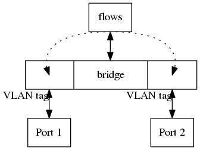
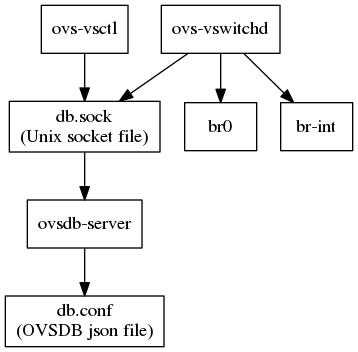

********
OVS 简介
********

关于本文
========

本文用于OVS技术分享，本文的目标是为了帮助对OVS感兴趣的技术人员，使其较快的了解及学习如何使用OVS。

本文的内容主要以个人的经验积累为基础, 即更多的以个人视角，能google到的东西，大概是不会放在这里的。

本文假设的学习受众，应该具有一定的网络基础，包括但不限于：

  - 知道网络是分层的：

    - 链路层/Data Link Layer/L2： 这里可见数据包的以太网地址，ether src/dst，可见数据包的以太网数据包类型，如ARP，IP，IPv6等。
    - 网络层/Internet Layer/L3: 这里可见数据包的IP地址，IP协议，如TCP，UDP等。
    - 传输层/Transport Layer/L4: 例如对于TCP数据包这里可见源与目的端口，和TCP flags。

  - 知道网络是分段的：

    - 网络中的设备，处于不同的链路上，不同的网段上，不同的网络分区中；而网络的基础命题，就是如何打通各个彼此不通的设备。
    - 对于一般的网络连接故障，工程师也是一段一段的去逐步排查，以缩小“搜索”范围。

  - (*)知道网络是分namespace的：

    - 这个主要针对Linux主机而言。Namespace是Linux内核在3.x版本提供的一个功能。而Network Namespace，即netns提供了在操作系统内“分割”网络空间的能力。
    - 在使用/创建新的netns前，操作系统当前所处的netns可以称之为root netns。所有新添加的网络设备（如网卡，veth peer等，以下简称网口）都会默认加入到root netns中。
    - 在创建了新的netns后，网口可以被添加/“绑定”到新的netns中，之后只有在此netns中可见该网口，且当离开root netns时，网口会down掉。当网口已经绑定到了特定的netns，与网口对应的数据包，端口，以及服务就都被划分到了特定的netns中。

    - 继续跑题：

      - 你可以将一个远程主机（当然最好是你本地的虚机）的eth0添加到一个非root的netns里，然后你就会发现连不上去了。
      - 因为网卡的netns变更了（离开root netns），所以它down掉了。之后你可能想办法把它up起来，并且重新配置IP。但这样做之后，你会发现能ping通，但ssh不上去。
      - 因为ping是不需要服务的，网卡收上数据包后，内核协议栈处理完了就回了；但是ssh是需要sshd服务的，而你只变更了网卡的netns，但sshd服务一般都是跑在root netns里的，也就是说在新创建的netns里是没有sshd服务的，故而ssh连不上。
      - 当然你也可以在非root netns里跑sshd，这样你就又可以ssh上来了。不过，你能重新登录的是你创建的非root netns。
      - 如何将一个网卡重新加到root netns里：ip l set DEV netns 1


OVS 是什么
==========

OVS，即Open vSwitch，开源项目，致力于为基于Linux的hypervisors提供功能丰富的虚拟交换机。作为虚拟交换机，它支持端口镜像，VLAN，以及其他一些网络监控协议。无论是在OpenStack还是OpenShift中，OVS最大的用处，都是通过在各个计算节点上运行一个虚拟交换机实例，来构建一个服务于虚机或容器的虚拟大二层。

作为云平台基础架构的固件，以我粗鄙的认识，OVS可以简单的理解为 网桥 + (VLAN) + flows。VLAN的使用情况依照具体环境而定，例如:

  - 在OpenStack中，大多数虚机数据包的行为是不可预测的，因此利用OVS的VLAN tag来做虚拟网络隔离的话，就会即简单又好用;
  - 在OpenShift中，容器数据包的行为是可预测的，并且可以做到无多播，因此即使不利用VLAN也能提供虚拟网络的隔离。并且仅用flows而不用VLAN tag，对于不同项目的网络打通，实现起来会更轻便灵活。




OVS的网桥
---------

网桥，如LinuxBridge，在Linux上允许你构建本地虚拟网络二层，即可以搭建虚拟的链路层拓扑。你可以从OVS的CLI命令中观察到OVS的核心资源有bridge(br)和port，即网桥和网桥上的端口，而这两者都是与虚拟二层相关的，是构建虚拟二层网络模型的原子。


网桥的基本处理命令
``````````````````

一些命令示范如下::

    # 创建名为br0的ovs网桥
    ovs-vsctl add-br br0

    # 在网桥br0上创建一个叫做p1的端口，并设置其类型为internal
    ovs-vsctl add-port br0 p1 -- set interface p1 type=internal

    # 用下面这个命令可以查看当前的ovs虚拟网络拓扑，可以看到当前有哪些网桥，网桥上有哪些端口
    ovs-vsctl show

    # 通过ovs-vsctl show 命令，你可能看到类似如下的结果
    ...
    Bridge "br0"       // 这是一个网桥
        Port "p1"      // 这是一个网口
            Interface "p1"
                type: internal   // 网口的类型
        Port "br0"     // 这是网桥自带的同名网口
            Interface "br0"
                type: internal
    ...

以下代码片段在上面的命令的基础上，进一步丰富了虚拟二层网络的拓扑，可以用来检验网桥的最基本的连通性::

    ip netns add n2 
    ip l add p2 type veth peer name p2o
    ip l set p2 netns n2 
    ip netns exec n2 ip l set p2 up
    ovs-vsctl add-port br0 p2o
    ip l set p2o up
    ip netns exec n2 ip a add dev p2 10.0.0.12/24   // 假设p1已经set up，并且配置了10.0.0.11/24

操作完后，你可以在root netns或者netns n2中，通过ping和tcpdump命令来验证连通性。

虽然名为bridge，但每一个OVS的网桥实际上都是一个独立的虚拟交换机(switch)。


OVS的VLAN
---------

OVS网桥上的port可以被设置tag，而这个tag就是OVS的VLAN，就如同交换机上的端口设置VLAN ID一样。tag值的有效范围为1~4094，0代表unset。你可以通过以下命令来操作port的tag::

    # 为port p1设置tag 123
    # 设置后，将发现p1无法在ping通p2，因为它们已经在不同的VLAN里了
    ovs-vsctl set port p1 tag=123

    # 查询p1的tag
    ovs-vsctl get port p1 tag

    # 重置p1的tag
    ovs-vsctl set port p1 tag=0

    # 当然，用ovs-vsctl show看到的虚拟二层拓扑也包含了tag信息，例如
    Bridge br-int
        fail_mode: secure
        Port "tap9340e288-8d"
            tag: 1
            Interface "tap9340e288-8d"
                type: internal
        Port "qvo45355e31-1d"
            tag: 13
            Interface "qvo45355e31-1d"
        Port "ha-0025e992-31"
            tag: 24
            Interface "ha-0025e992-31"
                type: internal
        Port "qvob83c9d24-59"
            tag: 12
            Interface "qvob83c9d24-59"


OVS的flow
---------

如果只是构建虚拟二层网络，那么LinuxBridge也可以（VLAN的隔离可以用不同的网桥来做），也就看不出OVS有什么价值了。不过OVS有flow，这使得OVS能对数据包做二层及以上的处理，包括ARP待答，路由转发，DHCP待答，端口转发，ACL。甚至在OVS的子项目OVN里，四层的LB也能通过OVS的flow来实现。


初窥flow
````````

一些命令展示如下::

    # 通过ovs-ofctl dump-flows命令我们可以查看某一网桥上的flows
    ovs-ofctl dump-flows br0

    # 更进一步的，你可以为你的query指定filters。
    # 如指定查找网桥br0上的，table 0中的，匹配icmp数据包的flows
    ovs-ofctl dump-flows br0 "table=0,icmp"

回到我们之前创建的网桥br0，目前为止，我们没有对br0上的flows做任何的添加/修改/删除操作，因此，*dump-flows* 的时候，你可能会看到这样一条flow::

    cookie=0x0, duration=21.258s, table=0, n_packets=0, n_bytes=0, idle_age=21, priority=0 actions=NORMAL

我们先来简单了解一下这条flow做了什么。该flow中的字段如 *duration*, *n_packets*, *n_bytes*, *idle_age* 都是用于状态统计，而 *table* 现在可以先理解为flows的分组，*priority* 表明该flow在当前table中的优先级。这条flow什么都不匹配，即对于任何数据包而言，都是满足“匹配条件”的。匹配之后，OVS使用actions NORMAL来处理数据包。

NORMAL action会按照二层交换机的模式去处理数据包，即:

  - 对于单播:

    - 如果目标MAC在“本地的MAC表”中，（且VLAN ID匹配）就转发到对应的port转发出去
    - 否则drop

  - 对于多播: 向网桥上所有非入口的（VLAN ID匹配的）port进行转发

基本上这条flow保证了br0可以像一般的网桥那样去工作。

以上的内容，基本上说明了当有flow时，数据包会被如何处理。那么，如果网桥上没有flows呢？可以做个简单的实验，通过以下命令删除网桥上的flows::

    # 清空网桥br0上的所有flows
    ovs-ofctl del-flows br0

    # 当然，更进一步的，你可以像dump-flows那样，为del-flows添加filters
    # 例如，删除网桥br0上，table 1中的，匹配数据包目的IP为10.0.0.10的flows
    ovs-ofctl del-flows br0 "table=1, nw_dst=10.0.0.100"

在清空br0上的flows之后，我们可以发现，再次进行的网桥连通性测试会失败，在前面的实例中，我们创建的两个端口将无法互ping。

这就是flows对于OVS网桥的基本作用:

  - 你可以利用flows来显式地定义数据包如何被转发，被处理
  - 而对于没有flows定义的数据包行为，网桥只会将它们drop

    - 例如，你定义了ARP请求可以被转发，而没有其他flow来处理ARP应答，那么网桥上的端口将得不到ARP应答，因为它们都被网桥drop了

flow的更多细节将在后续展开。


OVS的架构
=========



OVS的进程主要有两个，ovs-vswitchd和ovsdb-server::

    ps -e | grep ovs
     3277 ?        00:00:00 ovsdb-server
     3287 ?        00:00:00 ovs-vswitchd

ovs-vswitchd用来管理虚拟交换机，即OVS网桥；ovsdb-server将启动一个db server，用来管理OVS的虚拟网络拓扑信息，例如网桥，端口及其配置等。

ovsdb-server将配置存入到一个基于OVSDB协议的json格式的文本文件在，并暴露一个unix socket文件或tcp端口供ovs-vswitch和CLI来监听或使用。

当我们用CLI *ovs-vsctl* 更改OVS的虚拟网络拓扑时，如添加网桥，都是先将新的数据通过ovsdb-server写入到OVSDB json文件，然后ovs-vswitch在监听到数据变化后，再拉取新的数据来将变更落地。

**ovsdb-server不会将flows存入到“数据库”中，所以这将导致在ovs-vswitchd重启后，网桥上的流表将消失。**


OVS的资源——网桥与端口
=====================

如前说述，OVS在网络拓扑方面有两中资源，即bridge和port。Bridge和port都是单独的设备，有点像插线板和上面的插口。

现在，我们进一步解释说明这两类资源:

  - bridge

    - 同LinuxBridge的bridge一样，作为link layer的媒介，可以将不同的物理/虚拟网口资源桥接到一起，从而实现L2的打通
    - 具有VLAN功能，桥接到OVS bridge的port可以配置一个tag，这个tag就是OVS的local VLAN。所谓的local针对一个数据包而言，只要其还将被OVS处理，那么它就"属于"local的范围内。
    - 不同的桥可以通过patch port peer（直连网线）来相互关联

  - port

    - 所有接到bridge的，都叫port，无论虚实
    - 一般而言，有以下几种类型/type的port

      - internal port：在OVS上创建后，OVS就会在当前的root netns中产生的一个网口
      - vxlan port: vxlan隧道的端口
      - patch port: 网桥间的桥接端口对（直连网线口）
      - "" 即type为空的port: 实际上是将一个已经存在的port接入到OVS网桥上，例如虚机或者容器以veth peer方式接入到OVS网桥上对应的port的类型为空，桥接到OVS网桥的物理网卡所对应的类型也为空
      - 默认类型为空


OVS的资源——flow
===============

对于OVS的资源flow，我们一般有这样的俗称：将整个网桥上的flows称为流表，而将其中某一条flow称为流表规则。

我们先来回顾一下，一条flow哪些字段:

  - 用于做状态统计的:

    - duration:   这条flow在被添加上来后过了多久
    - n_packages: 这条flow匹配/处理了多少数据包
    - n_bytes:    这条flow匹配/处理了多少字节
    - idle_age:   这条flow当前多级没有匹配/处理数据包了
    - （这类的字段都是由OVS自动为每条flow配置的）

  - 与编排有关的:

    - table:      这条flow属于哪个table
    - priority:   这条flow在table中的优先级

  - 与数据操作有关:

    - actions:    这条flow要对匹配的数据包做如何的处理

上面的解释中，反复提到了匹配，但是却没有看到哪个字段是做匹配的。因为所有的匹配项本身就是单独的字段，一个flow可以有匹配字段，也可以一个都没有，即它们并不是固定出现在每个flow中的，完全取决于flow的设计，因此不便于在次列举。

因此，作为一个基本的格式，一条flow可以描述为::

    table=X, priority=Y, [MATCH_FIELDS], actions=ACTIONS

下面我将从实用的角度对flow的各个部分展开讲解。


table, priority与编排
---------------------

我所接触的成熟的项目，如Neutron, networking-ovn, OpenShift等，在OVS flows的编排上都有一个很直观的特点，即易读易维护，体现在:

  - 阶段性: 会利用不同的table，将数据包在网桥上的处理分为不同的阶段。就如同数据包的拆解过程一样，一层接一层
  - 方向性: 利用OVS编织的大二层，甚至大三层虚拟网络，需要考虑进入网桥的数据包的方向，即数据包是从本地的虚机或容器进入到网桥的，还是从外部进入到网桥的。网桥上的流表一般会根据不同的方向编排成相互独立的逻辑处理组
  - 功能性: 类似于与ARP相关的处理在一个表，而与TCP相关的处理在另一个表

为了达到这些目的，就必须使用不同的table。table具有以下属性:

  - table id的范围为 [0, 255)
  - 不指定table的flow将被加入到table 0
  - 所有的数据包进入到网桥后，都会先进入table 0进行处理

    （因此，成熟的flows设计都会在table 0来做针对数据包方向的分流，通过在flow中指定in_port来做，in_port匹配的值为网桥上的端口）

你完全可以认为table只是用来给flows进行分组的。而flow才是真正处理数据包的逻辑实体，因此:

  - 数据包在一个table中，只能被一条flow match并处理
  - 数据包在一个table所代表的阶段处理完了后，可能会需要进入到其他table/阶段进行后续处理，那么这条flow应该具有的以下action之一:

    - resubmit(, N)
    - goto_table:N

    这两个action的参数N为后续table的ID，即table彼此之间不能串联，但是可以通过flow的action来串联。
    （resubmit的参数有两个，第二个为table的ID，继续了解第一个参数，请使用man）

flows通过指定priority来决定，当一个table中有多个flows在数据包的匹配上都满足时，哪个flow来处理数据包。Priority具有以下属性:

  - 范围 [0, 65535]
  - 不指定时，flow的将默认获取32768的priority

priority是为了解决多flows都match的冲突，但如果match的多条flows的priority相同，那么最终flow的选择会进入一种玄学状态，即 *ovs-ofctl dump-flows* 显示的相对位置最靠上的那条flow会用来处理数据包。所以flows的设计需要避免这种人为冲突。

其实关于flows的编排，还有一个字段，cookie。但一般用于管理程序通过cookie来定位管理flows。


数据包的匹配
------------

(这部分实际上会比较多，想要详细列举所有的匹配项以及详细的信息，不如直接man。因此我在这里只会列举一些我见识过的常用的。)

在一个table中设计flow，一般要考虑如何去匹配数据包。以安全组为例，一般的思路是:

  - 明确什么样的数据包可以放行:

    - 通过特征匹配这样的数据包，然后放行/进入后续阶段的表
    - 没有匹配到的数据包，drop

  - 明确什么样的数据包不可以放行:

    - 通过特征匹配这样的数据包，然后drop
    - 没有匹配的数据包，放行

这里的特征一般有两类，1）数据包的元数据，包括以太网地址，IP地址，端口等；2）OVS在处理过程中通过flow指定添加的元数据，如metadata,reg0, tun_id等，简单的理解为OVS的对数据包加的逻辑标签就可以了。

对于数据包的元数据，常用的匹配项有:

  - 单字段:

    - arp: 数据包为ARP包
    - ip:  数据包为IP包
    - icmp
    - tcp
    - udp

  - 等式字段:

    - L2/Data Link Layer:

      - dl_vlan:       数据包的Data Link layer VLAN ID
      - dl_src/dl_dst: 数据包的Data Link layer source/destination address
      - arp_op:        ARP/RARP数据包的Operation code, e.g. 1：ARP Request, 2: ARP Reply
      - arp_spa/arp_tpa: ARP/RARP数据包的source/target Protocol Address (请求所询问的IP)
      - arp_sha/arp_tha: ARP/RARP数据包的source/target Hardware Address (请求所询问的MAC地址)

    - L3/Network Layer:

      - nw_src/nw_dst: 数据包的Network layer source/destination address
      - nw_ttl:        TTL
      - icmp_type:     ICMP数据包的Type，e.g. 0: ICMP Echo Reply, 8: ICMP Echo Request
      - icmp_code:     ICMP数据包的Code, e.g. 0: Network unreachable, 1: Host unreachable

    - L4/Transport Layer:

      - tcp_src/tcp_dst
      - udp_src/udp_dst
      - tcp_flags

而对于OVS的元数据，常用的匹配项有（均为等式字段）:

  - in_port:  数据包从OVS网桥上的哪个端口进来的
  - tun_id/tunnel_id: 一些实现会将OVS在数据包处理过程中flow添加的元数据加入到tun_id中，用以保持元数据跨节点的一致性

对于单字段匹配项如arp，ip等，其实OVS提供的便利，是对等式字段dl_type(Data Link layer type), nw_proto(Network layer protocol)的分装，例如：

  - arp: dl_type=0x0806
  - tcp: dl_type=0x0800, nw_proto=6

**所有具有协议特征的匹配项，都需要协议类型优先被匹配** ，例如要匹配DNS请求包，即udp_dst=53，那么首先得添加条件去匹配udp包。这与包的拆解过程如出一辙。

对于等式字段，除了可以单值匹配，部分匹配项还支持使用mask方式“通配”，格式为value/mask，例如:

  - dl_dst=01:00:00:00:00:00/01:00:00:00:00:00, 匹配所有的多播包
  - nw_src=10.0.0.0/24，匹配来自某一CIDR的IP包

具体情况请参考man。

接下举一些添加flows的例子，用以说明如何考虑匹配数据包，以及匹配项的使用场景::

    # 在table 0中，利用in_port来匹配不同端口进入网桥的包
    # 在逻辑上，我们可以只到哪些端口进来的包，是虚机/容器访问外部的，哪些是反过来的
    table=0, priority=1, in_port=INGRESS_PORT, actions=resubmit(,1)
    table=0, priority=1, in_port=EGRESS_PORT, actions=resubmit(,10)

    # 在ingress方向，进一步按协议分流，非ARP非IP的包将被丢弃
    table=1, priority=1, arp, actions=resubmit(,2)
    table=1, priority=1, ip, actions=resubmit(,3)
    table=1, priority=0, actions=drop

    # 在ingress方向的ARP表中，如果ARP target protocol address对应的IP是本地虚机的IP，
    # 即ARP请求所询问的IP是本地虚机的，则从响应端口转发出去，否则drop
    table=2, priority=1, arp, arp_tpa=LOCAL_VM_IP, actions=output:LOCAL_VM_PORT
    table=2, priority=0, actions=drop

    # 在ingress方向的IP表中，允许DHCP应答包能被放行，允许目标IP是本地虚机的包能从对应
    # 端口发出，其他情况drop
    table=3, priority=2, udp, udp_src=67, udp_dst=68, actions=NORMAL
    table=3, priority=1, ip, nw_dst=LOCAL_VM_IP, actions=output:LOCAL_VM_PORT
    table=3, priority=0, actions=drop

    ...

这个例子中，没有展示egress方向的flows，但基本的逻辑差不多。此外，这个例子中没有看到命令 *ovs-ofctl add-flow* ，因为实际上，你可以将这些flows写入一个文本文件，按后用命令 *ovs-ofctl add-flows BRIDGE FILE* 来批处理添加。


数据包的actions
---------------

一个数据包由一个flow match之后，OVS将按照该flow的actions对数据包进行处理。常见的有:

   - NORMAL
   - drop
   - resubmit/goto_table
   - output:OFPORT: 将数据包从指定的端口转发出去
   - in_port: 将数据包按照“哪来回哪去”的方式转发
   
OPPORT为OVS的一种ID，你可以用以下命令来查询OFPORT具体对应网桥上的哪个端口::

    # 通过grep 查询网桥br0上ofport为123的网口
    ovs-ofctl show br0 | grep 123

    # 通过ovs-vsctl 查询ovsdb来粗略地寻找ofport为123的网口
    ovs-vsctl find interface ofport=123

上面的命令 *ovs-vsctl find interface* 只能粗略的找到满足特定值的端口，即可能找到多个网桥上都具有特定值的端口。不过这也从侧面说明ofport这一值是各个网桥所独立持有的本地值。

对于in_port这一个action，也说明了一个OVS的对待数据包转发的特点，即不会主动将数据包发回到其”入口“，即使是在output:X中指定了也不行。而强制这样做的操作主要有in_port和ALL，ALL会向网桥上的所有端口去转发数据包，这很粗糙，强烈不建议这么做。


**ADVANCED**
如下的actions，展示了如何做ARP待答，修改完数据包后，数据包将从”入口“发出::

    # copy源MAC到目的MAC
    move:NXM_OF_ETH_SRC[]->NXM_OF_ETH_DST[],
    # 修改源MAC为待答的MAC地址12:34:56:78:9a:bc
    mod_dl_src:12:34:56:78:9a:bc,
    # 修改ARP数据包的Operations，修改为ARP reply
    load:0x2->NXM_OF_ARP_OP[],
    # copyARP数据包的source hardware/protocol address到target hardward/protocol address
    move:NXM_NX_ARP_SHA[]->NXM_NX_ARP_THA[],
    move:NXM_OF_ARP_SPA[]->NXM_OF_ARP_TPA[],
    # 将待答的MAC和IP设置到ARP数据包的source hardware/protocol address
    load:%(mac)#x->NXM_NX_ARP_SHA[],
    load:%(ip)#x->NXM_OF_ARP_SPA[],
    in_port


OVS的CLI
========

讲完资源，接下来就该将如何操作了。OVS提供了丰富的CLI，以及IDL(python)。CLI虽然丰富，但我主要用 *ovs-vsctl* 和 *ovs-ofctl* ，基本够用了（其他的要么很少用，要么没用过）。前者操作网络拓扑和数据库，后者操作flow。

当然不常用的CLI里有也很好用命令, 例如::

    ovs-appctl ofproto/trace br-int in_port="tap2c26a446-10",dl_dst=fa:16:3e:d6:f1:1a,dl_src=fa:16:3e:8c:4c:59,ip,nw_src=10.0.0.7,nw_dst=10.0.0.5,nw_ttl=64

这条命令通过OVS构造了一个数据包，有源和目的MAC及IP，TTL为64。这个数据包将从端口"tap2c26a446-10"流入到br-int网桥，然后按照流表的规则进行处理，就像从虚机/容器发出的包那样。OVS会将这个数据包在网桥的流表中“走过的路径”打印出来。


ovs-vsctl
---------

对于ovs-vsctl，用于操作网络拓扑的命令，help和man就可以知道很多了，这里不再赘述。值得说的地方有:

  - 命令拼接符 "- -" (减减)
 
    - 多个命令可以由 - - 进行拼接
    - 当你的程序需要操作ovs，而你没有用IDL时，你不得不通过shell来间接操作CLI。那么在这种情况下，如果你有多个命令可以在一个批次进行处理，那么建议使用 - - ，否则多次调用shell会得到更为低下效率。e.g.::

        ovs-vsctl add-port br-int 2-phy-br -- set interface 2-phy-br type=internal -- set interface 2-phy-br options=peer:2-int-br

    - 并且 - - 在相邻的命令逻辑里，对与数据的缺失进行补充，例如上述的命令，如果只输入第一部分就会报错，因为默认的“”类型的port，是需要对应的端口“实体”的，而第二个命令追加了对端口类型的修正，避免了出错
    - 当然，上例中 set interface 的部分可以合并成一个command，即 *set interface 2-phy-br type=internal options=peer:2-int-br* ，但为了说明 - - ，因为拆分成了两个部分

  - 转义符 \\

    这个纯属无奈，因为CLI命令解析的原因，某些情况下，例如，在使用了双引号（"）作为命令参数的一部分时，可能无法得到很好的解析，此时你就需要转义. e.g.::

        # 如果想要查看ovs中类型不为""(空)的接口，那么命令:
        ovs-vsctl find interface type!=""
        # 将会得到奇怪的报错：
        ovs-vsctl: type!=: argument does not end in "=", "!=", "<", ">", "<=", ">=", "{=}", "{!=}", "{<}", "{>}", "{<=}", or "{>=}" followed by a value.

        # 而加上转义符才能的到正确的输出
        ovs-vsctl find interface type!=\"\"

    当然不只是双引号会带来麻烦，大于号这样的shell符号（输出重定向）也会::
    
        # 如果想要查看ovs中interfaces属性包含ID为9a25d29e-dae8-4e73-828b-2cacfed1588c的port，那么，也需要转义：
        # 以我浅薄的见识，一个port一般只对应一个interface，所以这个例子主要是为了展示对于操作符的转义
        ovs-vsctl find port interfaces{\>=}9a25d29e-dae8-4e73-828b-2cacfed1588c

  - 字典属性值:

    - 对于dict属性的操作，在前面的命令拼接符的例子中已可见一斑，即一般而言，需要使用冒号（:）
    - 格式大致为 ATTR:SUB-ATTR [OP] [VALUE], e.g.::

        # 设置接口 INTF的external_ids中的name属性为hello
        ovs-vsctl set interface INTF external_ids:name="hello"

        # 获取接口 tap0a4d6145-a9的接受数据包的统计
        ovs-vsctl get interface tap0a4d6145-a9 statistics:rx_packets

        查找发送数据包统计中发包量大于0的接口
        ovs-vsctl find interface statistics:tx_packets\>0

    - 关于external_ids，主要要被第三方使用，你可以在这个属性中塞入任意的key value来从网络方面对一个属于计算的port进行标记。

  - 操作数据库:

    - 结合在OVS架构方面的介绍，其实上面的 *ovs-vsctl OP interface* 例子都是在通过CLI在操作数据库，因此 *OP* 如 *set get find* 等其实都是ovsdb的数据库操作。此外，较常用的操作还包括 *list* 。虽然不排除也有需要用到 *add remove* 等操作的可能性，但毕竟像 *add-port* 这样的操作已经提供了便利性，因此也不推荐使用；而另一方面，如果想更直接的操作数据，应该用IDL。


ovs-ofctl
---------

同ovs-vsctl，这里只讲一些我觉得需要注意的点:

  - dump-flows 和 del-flows 都可以通过添加filters作为参数，来缩小flows的范围，可以参考前面的例子
  - del-flows 如果不指定filters会删除网桥上的所有flows，而指定后，只会删除满足filters的flows。因此当你删除flow时，建议的做法时，先用dump-flows来逐步缩小范围，确定不存在误伤后，在用del-flows用相同的filters进行删除
